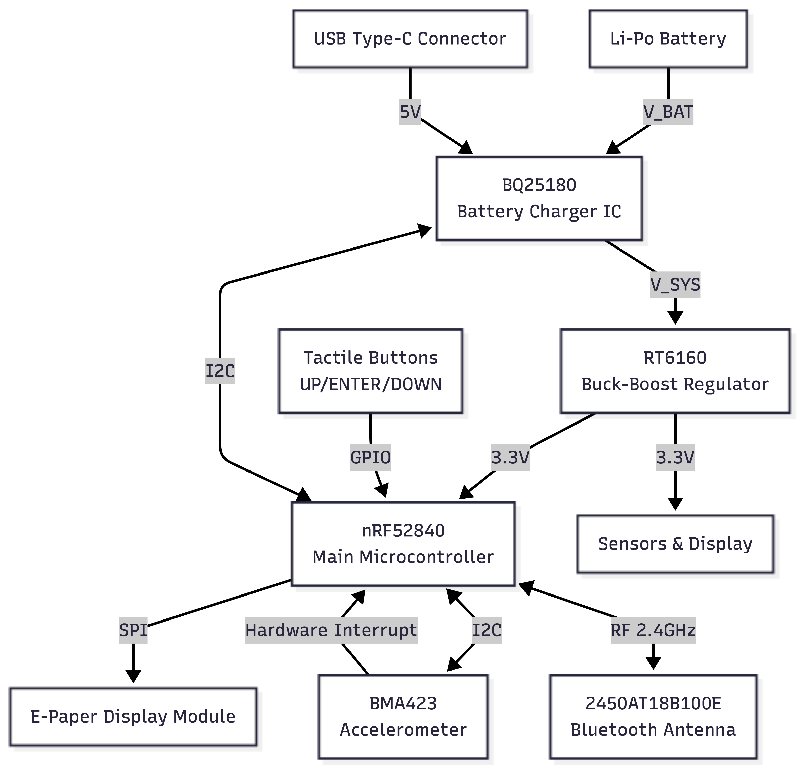

## System Overview

InkTime is a low-power wearable platform built around the nRF52840 SoC, integrating MCU functionality with BLE connectivity.

System power is regulated via an RT6160 buck-boost converter, maintaining a stable 3.3V rail across the full Li-Po discharge range.

---

## Functional Architecture

The system is partitioned into three main domains:

- **Compute & RF** – nRF52840 (processing + BLE stack)
- **Power Management (PMIC + Regulation)** – charging and DC-DC conversion
- **Peripheral Interfaces** – sensors, display, and user I/O

### Block Diagram

---

## Hardware Overview

### Processing Core
nRF52840:
- ARM Cortex-M4F @ 64 MHz  
- Integrated BLE 5.x stack  
- EasyDMA for peripheral offloading  

Enables low-duty-cycle operation with minimal CPU wake time.

---

### Power Subsystem

- **Charging (BQ25180):**  
  Linear charger with CC/CV profile and I2C control. Supports ship mode for ultra-low leakage.

- **Regulation (RT6160):**  
  Buck-boost topology ensures a regulated 3.3V system rail independent of battery voltage (≈3.0–4.2V range).  
  Eliminates brown-out conditions during RF TX bursts.

---

### Interfaces & Peripherals

- **SPI (Display):**  
  Dedicated bus for E-Paper panel. Power is only consumed during refresh cycles (bi-stable behavior).

- **I2C (Sensors / PMIC):**  
  Shared bus for IMU and power IC.  
  BMA423 operates in interrupt mode → event-driven MCU wake-up.

---

## Bill of Materials

| Ref | Device | Function | Package | JLC | Datasheet |
| :-- | :-- | :-- | :-- | :-- | :-- |
| U1 | nRF52840 | MCU + BLE radio | QFN-48 | C3606653 | https://www.lcsc.com/datasheet/C3606653.pdf |
| IC9 | RT6160 | Buck-boost regulator (3.3V rail) | WLCSP-15B | C7065276 | https://wmsc.lcsc.com/wmsc/upload/file/pdf/v2/lcsc/2312271436_Richtek-Tech-RT6160AWSC_C7065276.pdf |
| IC1 | BQ25180 | Li-Po charger / PMIC | DSBGA-8 | C3682423 | https://www.ti.com/cn/lit/ds/symlink/bq25180.pdf?ts=1775594237116 |
| U2 | MAX17048G | Battery fuel gauge (I2C) | DFN-8-EP | C2682616 | https://www.lcsc.com/datasheet/lcsc_datasheet_2410121738_Analog-Devices-Inc--Maxim-Integrated-MAX17048G-T10_C2682616.pdf |
| IC3 | BMA423 | 3-axis accelerometer | LGA-12 | C189517 | https://www.lcsc.com/datasheet/C189517.pdf |
| IC2 | DRV2605 | Haptic driver | DSBGA-9 | C81079 | https://www.ti.com/cn/lit/gpn/drv2605 |
| ANT1 | 2.45GHz antenna | RF interface (BLE) | 1206 | C2917717 | https://www.lcsc.com/datasheet/lcsc_datasheet_2404021210_Johanson-Dielectrics-2450AT18B100E_C2917717.pdf |
| X1 | 32 MHz crystal | HF clock source | SMD3225 | C9009 | https://www.lcsc.com/datasheet/lcsc_datasheet_2403291504_YXC-Crystal-Oscillators-X322532MOB4SI_C9009.pdf |
| X2 | 32.768 kHz crystal | LF RTC clock | SMD3215 | C32346 | https://www.lcsc.com/datasheet/lcsc_datasheet_2404180925_Seiko-Epson-Q13FC13500004_C32346.pdf |
| J4 | USB-C | Power + data interface | SMD | C709357 | https://www.lcsc.com/datasheet/lcsc_datasheet_2404191039_Shenzhen-Kinghelm-Elec-KH-TYPE-C-16P_C709357.pdf |
| J1 | FPC (24p) | Display interface | 0.5mm | C122434 | https://www.molex.com/content/dam/molex/molex-dot-com/products/automated/en-us/salesdrawingpdf/503/503480/5034802400_sd.pdf |
| J2 | FFC (6p) | Auxiliary connector | 1mm | C90533 | https://wmsc.lcsc.com/wmsc/upload/file/pdf/v2/lcsc/1810141506_LX-FFC6P1-0mm7CM_C90533.pdf |
| Q1 | IRF4905PBF | P-MOS high-side switch | TO-220AB | C2564 | https://www.lcsc.com/datasheet/lcsc_datasheet_1809041724_Infineon-Technologies-IRF4905PBF_C2564.pdf |
| Q3 | Si1308EDL | N-MOS load switch | SOT-323 | C469327 | https://www.lcsc.com/datasheet/lcsc_datasheet_1912202016_Vishay-Intertech-SI1308EDL-T1-GE3_C469327.pdf |
| D3 | USBLC6-2SC6Y | USB ESD protection | SOT-23-6L | C2969755 | https://wmsc.lcsc.com/wmsc/upload/file/pdf/v2/lcsc/2211080730_STMicroelectronics-USBLC6-2SC6Y_C2969755.pdf |
| D2, D4, D5 | MBR0530 | Schottky diodes | SOD-123 | C82046 | https://www.lcsc.com/datasheet/lcsc_datasheet_2304140030_onsemi-MBR0530T1G_C82046.pdf |
| L5 | 4.7µH | DC-DC inductor | 4.8×4.8 | C1329646 | https://wmsc.lcsc.com/wmsc/upload/file/pdf/v2/lcsc/2304140030_BOURNS-SRR4828A-4R7Y_C1329646.pdf |
| L7 | 470nH | Filtering inductor | 1008 | C5832368 | https://wmsc.lcsc.com/wmsc/upload/file/pdf/v2/lcsc/2306021632_cjiang--Changjiang-Microelectronics-Tech-FTC252012SR47MBCA_C5832368.pdf |
| L1–L3 | 27nH | RF matching network | 0402 | C12669 | https://www.lcsc.com/datasheet/lcsc_datasheet_2304140030_Murata-Electronics-LQG15HS27NJ02D_C12669.pdf |
| SW_* | Tactile switches | User input | SMD | C569760 | https://wmsc.lcsc.com/wmsc/upload/file/pdf/v2/lcsc/2301111010_PANASONIC-EVPAKE31A_C569760.pdf |
| R* | 7.68kΩ | Bias / pull-ups | 0201 | C3920633 | https://wmsc.lcsc.com/wmsc/upload/file/pdf/v2/lcsc/2404081048_TE-Connectivity-CPF0201B511RE1_C3920633.pdf |
| C* | MLCC | Decoupling / bulk | 0201 | C9900156064 | https://ds.yuden.co.jp/TYCOMPAS/or/download?pn=MLAST063SCG681JFNA01&fileType=CA |
| TP | Test pads | Debug access | Copper | N/A | N/A |
| SJ1 | Solder jumper | Config link | Copper | N/A | N/A |

---

## MCU Pin Configuration

| Function | Signal | Pin | Dir | Notes |
| :-- | :-- | :-- | :-- | :-- |
| SPI (Display) | SCK | P1.01 | Out | Routed adjacent to FPC |
| SPI (Display) | MOSI | P1.02 | Out | Data line |
| SPI (Display) | CS | P1.03 | Out | Active low |
| Display Ctrl | D/C | P1.04 | Out | Command/data select |
| I2C | SDA | P0.26 | I/O | Shared bus |
| I2C | SCL | P0.27 | Out | Clock |
| IMU | INT1 | P0.11 | In | Wake interrupt |
| Button | BTN_UP | P0.13 | In | Internal pull-up |

---

## Design Notes

- **Pin muxing:** optimized for routing simplicity and minimal trace crossover  
- **System architecture:** event-driven (interrupt-based) → reduced average current  
- **PDN:** local decoupling placed <1mm from VDD pins  
- **RF layout:** strict antenna keep-out enforced (no copper below radiator)

---

## Images

### 3D PCB

### Assembly

