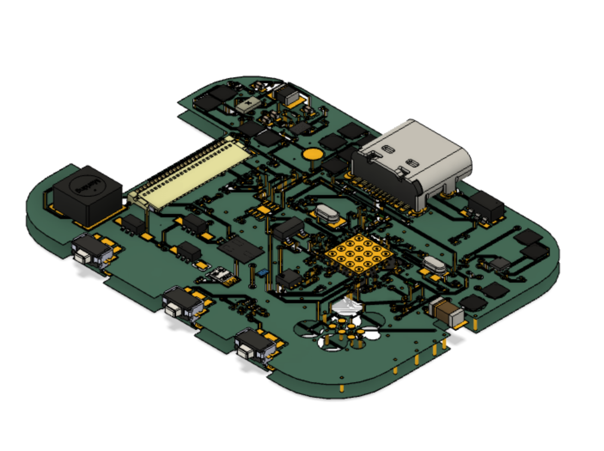
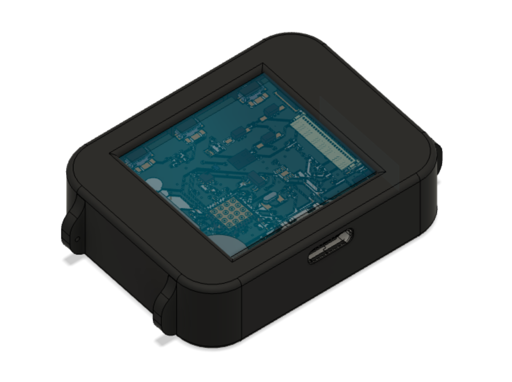
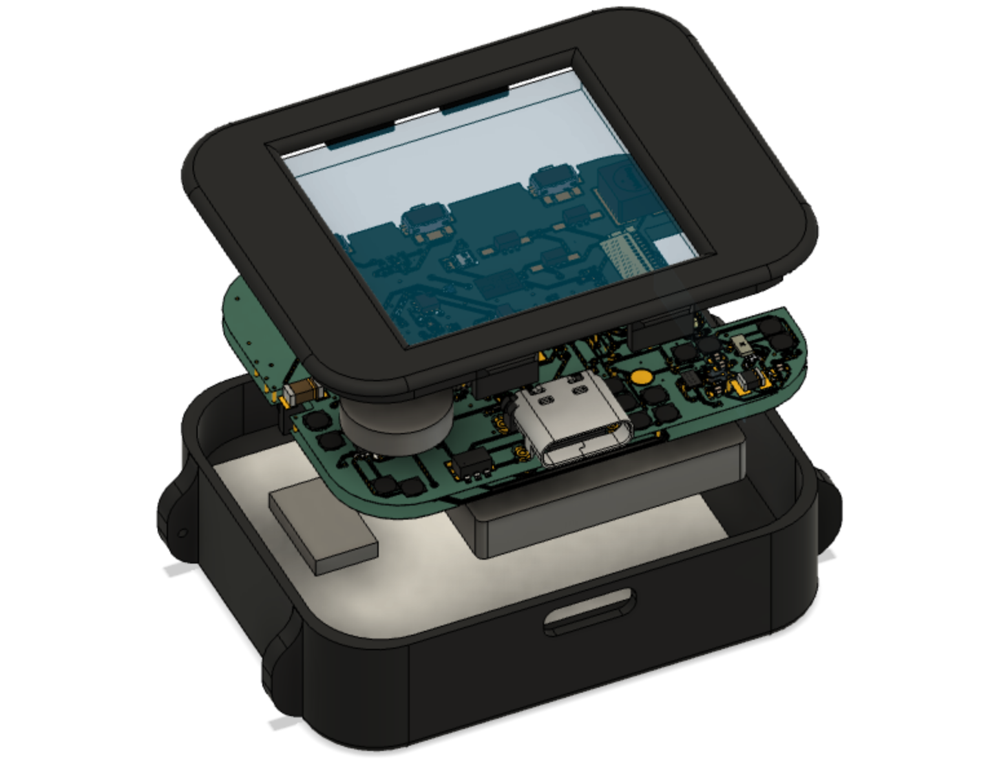

# InkTime Smartwatch

**Author:** Pirvu Tatiana  
**License:** GNU GPLv3  

---

## System Overview

The InkTime smartwatch is designed around a low-power embedded architecture, prioritizing energy efficiency and long battery life. At the center of the system sits the **nRF52840 SoC**, which integrates both processing capabilities and Bluetooth Low Energy (BLE 5.0) communication.

To maintain a stable operating voltage across varying battery levels, the design incorporates a **buck-boost regulator (RT6160)**. This ensures a consistent 3.3V supply rail, regardless of whether the Li-Po battery is fully charged or nearing depletion.

---

## Functional Architecture

The device is split into three primary subsystems:

- **Processing & Communication Core** – handled by the nRF52840  
- **Power Regulation & Charging** – managed by a dedicated charger IC and DC-DC converter  
- **Peripheral Interface Layer** – includes sensors and display communication  

### Block Diagram

---

## Key Hardware Elements

### Processing Unit
The nRF52840 features:
- ARM Cortex-M4F core @ 64 MHz  
- Integrated BLE stack  
- EasyDMA for efficient peripheral data handling  

This allows the CPU to remain in low-power states while peripherals (like SPI) operate independently.

---

### Power Subsystem

- **Battery Charging:**  
  The BQ25180 charger IC uses a CC/CV charging profile and communicates with the MCU via I2C. It also includes a "Ship Mode" to eliminate leakage during storage.

- **Voltage Regulation:**  
  The RT6160 dynamically switches between step-up and step-down modes to maintain a fixed 3.3V output. This prevents instability during high-current events such as radio transmission.

---

### Sensors & Interfaces

- **Display (SPI):**  
  The E-Paper display only consumes power during refresh cycles. Once updated, it retains the image without additional energy.

- **Sensor Bus (I2C):**  
  The BMA423 accelerometer shares the I2C bus with the power IC. It performs motion processing internally and signals the MCU via interrupts only when needed.

---
## Bill of Materials (Engineering Format)

| Ref | Device | Function | Package | JLC | Datasheet |
| :-- | :-- | :-- | :-- | :-- | :-- |
| U1 | nRF52840 | Main MCU + BLE radio | QFN-48 | C3606653 | https://www.lcsc.com/datasheet/C3606653.pdf |
| IC9 | RT6160 | Buck-boost regulator (3.3V rail) | WLCSP-15B | C7065276 | https://wmsc.lcsc.com/wmsc/upload/file/pdf/v2/lcsc/2312271436_Richtek-Tech-RT6160AWSC_C7065276.pdf |
| IC1 | BQ25180 | Li-Po charger / PMIC | DSBGA-8 | C3682423 | https://www.ti.com/cn/lit/ds/symlink/bq25180.pdf?ts=1775594237116 |
| U2 | MAX17048G | Battery fuel gauge (I2C) | DFN-8-EP | C2682616 | https://www.lcsc.com/datasheet/lcsc_datasheet_2410121738_Analog-Devices-Inc--Maxim-Integrated-MAX17048G-T10_C2682616.pdf |
| IC3 | BMA423 | 3-axis accelerometer (IMU) | LGA-12 | C189517 | https://www.lcsc.com/datasheet/C189517.pdf |
| IC2 | DRV2605 | Haptic driver | DSBGA-9 | C81079 | https://www.ti.com/cn/lit/gpn/drv2605 |
| ANT1 | 2.45GHz chip antenna | BLE RF interface | 1206 | C2917717 | https://www.lcsc.com/datasheet/lcsc_datasheet_2404021210_Johanson-Dielectrics-2450AT18B100E_C2917717.pdf |
| X1 | 32 MHz crystal | System clock source | SMD3225 | C9009 | https://www.lcsc.com/datasheet/lcsc_datasheet_2403291504_YXC-Crystal-Oscillators-X322532MOB4SI_C9009.pdf |
| X2 | 32.768 kHz crystal | RTC clock | SMD3215 | C32346 | https://www.lcsc.com/datasheet/lcsc_datasheet_2404180925_Seiko-Epson-Q13FC13500004_C32346.pdf |
| J4 | USB Type-C | Power + data interface | SMD | C709357 | https://www.lcsc.com/datasheet/lcsc_datasheet_2404191039_Shenzhen-Kinghelm-Elec-KH-TYPE-C-16P_C709357.pdf |
| J1 | 24-pin FPC connector | E-paper display interface | 0.5mm pitch | C122434 | https://www.molex.com/content/dam/molex/molex-dot-com/products/automated/en-us/salesdrawingpdf/503/503480/5034802400_sd.pdf |
| J2 | 6-pin FFC cable | Auxiliary connection | 1mm pitch | C90533 | https://wmsc.lcsc.com/wmsc/upload/file/pdf/v2/lcsc/1810141506_LX-FFC6P1-0mm7CM_C90533.pdf |
| Q1 | IRF4905PBF | P-channel MOSFET (power switching) | TO-220AB | C2564 | https://www.lcsc.com/datasheet/lcsc_datasheet_1809041724_Infineon-Technologies-IRF4905PBF_C2564.pdf |
| Q3 | Si1308EDL | N-channel MOSFET | SOT-323 | C469327 | https://www.lcsc.com/datasheet/lcsc_datasheet_1912202016_Vishay-Intertech-SI1308EDL-T1-GE3_C469327.pdf |
| D3 | USBLC6-2SC6Y | USB ESD protection | SOT-23-6L | C2969755 | https://wmsc.lcsc.com/wmsc/upload/file/pdf/v2/lcsc/2211080730_STMicroelectronics-USBLC6-2SC6Y_C2969755.pdf |
| D2, D4, D5 | MBR0530 | Schottky diodes | SOD-123 | C82046 | https://www.lcsc.com/datasheet/lcsc_datasheet_2304140030_onsemi-MBR0530T1G_C82046.pdf |
| L5 | 4.7µH inductor | DC-DC energy storage | SMD 4.8×4.8 | C1329646 | https://wmsc.lcsc.com/wmsc/upload/file/pdf/v2/lcsc/2304140030_BOURNS-SRR4828A-4R7Y_C1329646.pdf |
| L7 | 470nH inductor | Filtering / RF support | 1008 | C5832368 | https://wmsc.lcsc.com/wmsc/upload/file/pdf/v2/lcsc/2306021632_cjiang--Changjiang-Microelectronics-Tech-FTC252012SR47MBCA_C5832368.pdf |
| L1, L2, L3 | 27nH inductors | RF matching network | 0402 | C12669 | https://www.lcsc.com/datasheet/lcsc_datasheet_2304140030_Murata-Electronics-LQG15HS27NJ02D_C12669.pdf |
| SW_UP, SW_ENT, SW_DN | Tactile switches | User input controls | SMD 3.9×2.9 | C569760 | https://wmsc.lcsc.com/wmsc/upload/file/pdf/v2/lcsc/2301111010_PANASONIC-EVPAKE31A_C569760.pdf |
| Resistors | 7.68kΩ thin film | Biasing / pull-ups | 0201 | C3920633 | https://wmsc.lcsc.com/wmsc/upload/file/pdf/v2/lcsc/2404081048_TE-Connectivity-CPF0201B511RE1_C3920633.pdf |
| Capacitors | MLCC (generic) | Decoupling / filtering | 0201 | C9900156064 | https://ds.yuden.co.jp/TYCOMPAS/or/download?pn=MLAST063SCG681JFNA01&fileType=CA |
| C23, C27, C34, C42 | Special MLCC | Stability / critical nodes | - | C21012218 | https://jlc-prod-smt.oss-eu-central-1.aliyuncs.com/smtDataManualFile/8603520985945550848-C21012218.pdf |
| C24, C25, C33, C39 | MLCC | Local filtering | 0402 | C9900179830 | N/A |
| TP | Test pads | Debug / probing | Copper | N/A | N/A |
| SJ1 | Solder jumper | Config link (default open) | Copper | N/A | N/A |

---

## MCU Pin Configuration

| Function | Signal | Pin | Direction | Notes |
| :--- | :--- | :--- | :--- | :--- |
| Display SPI | SCK | P1.01 | Out | Clock routed near display connector |
| Display SPI | MOSI | P1.02 | Out | Data transmission |
| Display SPI | CS | P1.03 | Out | Active-low select |
| Display Control | D/C | P1.04 | Out | Command/data toggle |
| I2C Bus | SDA | P0.26 | I/O | Shared communication line |
| I2C Bus | SCL | P0.27 | Out | Clock line |
| IMU Interrupt | INT1 | P0.11 | In | Wake-up trigger |
| User Input | BTN_UP | P0.13 | In | Internal pull-up enabled |

---

## Design Choices

### Flexible Pin Mapping
The nRF52840 allows peripheral remapping across GPIOs. This flexibility was used to:
- Minimize trace lengths  
- Avoid routing conflicts  
- Improve signal integrity  

---

### Interrupt-Based Operation
Instead of continuous polling:
- The IMU generates interrupts  
- The MCU wakes only when necessary  

This significantly reduces average power consumption.

---

## PCB Design Notes

### Layer Stack & Grounding
A multi-layer PCB with a continuous ground plane was used to:
- Reduce noise  
- Improve return paths  
- Stabilize RF performance  

---

### RF Layout Considerations
A keep-out region was enforced around the antenna:
- No copper underneath  
- Prevents detuning and impedance mismatch  

---

### Power Integrity
Decoupling strategy includes:
- 100nF capacitors placed extremely close to IC supply pins  
- Bulk capacitors for low-frequency stability  

---

### Testability
Dedicated test pads were added for:
- Voltage probing (3.3V, GND)  
- Debug access during bring-up  

---

## Images

### 3D PCB

### Assembly Overview

---
